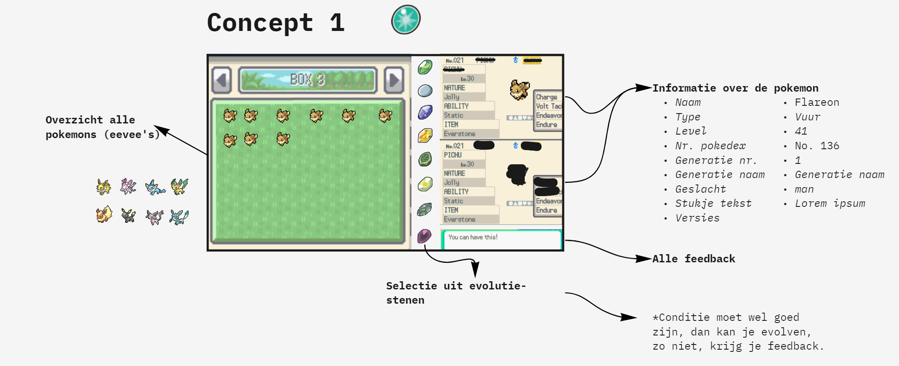
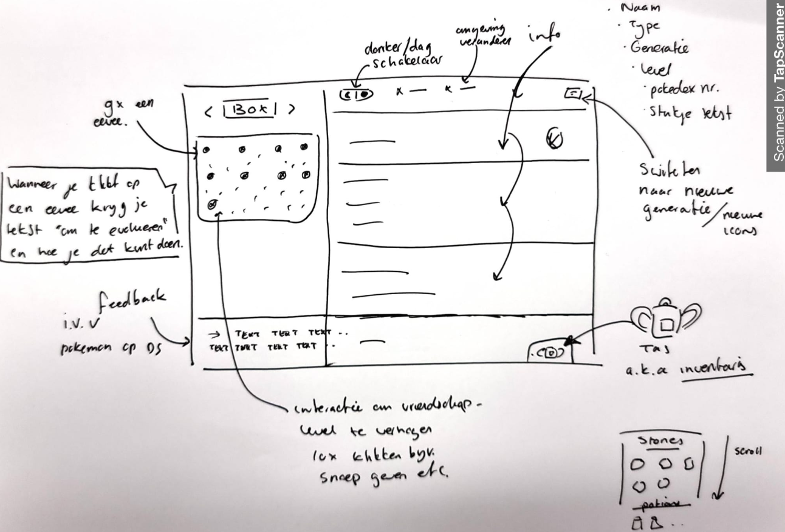

# Procesverslag
Markdown is een simpele manier om HTML te schrijven.  
Markdown cheat cheet: [Hulp bij het schrijven van Markdown](https://github.com/adam-p/markdown-here/wiki/Markdown-Cheatsheet).

Nb. De standaardstructuur en de spartaanse opmaak van de README.md zijn helemaal prima. Het gaat om de inhoud van je procesverslag. Besteedt de tijd voor pracht en praal aan je website.

Nb. Door *open* toe te voegen aan een *details* element kun je deze standaard open zetten. Fijn om dat steeds voor de relevante stuk(ken) te doen.

## Jij

### Ontwerper:
Yunus Emre Alkan

#### Je startniveau:
Zwart

# Je plan

  
De eerste versie/schets van je ontwerp & je persoonlijke uitdaging

  ### De eerste versie/schets:
  

  ### Je ambitie: 
  Aan deze technieken/punten wil ik werken:
  - Het meer en efficienter gebruiken van custom-properties
  - Elementen toevoegen/verwijderen middels Javascript
  - Ervaring en kennis opdoen over CSS Animaties
  - Ervaring opdoen met javascript in het algemeen
 

## Voortgang/Feedback 1

  In de eerste les ben ik eerst inspiratie gaan opdoen, ik ben daarom ook een moodboard gaan maken. Een moodboard met plaatjes van verschillende interfaces en informatie over de Eeevee's. Ook heb ik een video van de evolutie van Eevee gevonden, als ik tijd heb, wil ik deze ook graag maken. De 2e les ben ik mijn 3 concepten gaan laten zien aan mijn medestudenten, ik ben zelf doorgegaan met concept 1, omdat ik die zelf het leukst vond om te maken. Ik ben een wat betere schets gaan maken en heb hier feedback op gevraagd. Ik kreeg hier ook gelijk bevestiging op dat het een uniek en bijpassende interface was van Jorinda en andere klasgenoten.
  
  

  
  
Feedback van Jorinda

  ### Bevinding 1:
  De knoppen indeling wijzigen aan de bovenkant van het scherm.

  #### oplossing:
  Ik ben minder

  
  ### Bevinding 2:
  De tas met de items, moet meer opvallen.

  #### oplossing:
  Ik ben de tas meer opvallend gaan maken

  
  ### Bevinding 3:
  Ze gaf aan dat het leuk zou zijn om een custom pointer te hebben.
  
  #### oplossing:
  Dit is een goed punt, ik ga een leuke zoeken en toevoegen aan de website.
  
  
  ### Bevinding 4:
  Nadenken over de positie over de pop-up van de item-bag
  
  #### oplossing:
  Ik ben de item-bag op een andere plek gaan neerzetten, waardoor de pop-up goed bij het geheel past.

## Voortgang/Feedback 2

  
Mijn bevindingen + wijzigingen (minimaal 5)

  
  ### Bevinding 1:
  Omschrijving van wat er nog niet orde was (tekst en afbeeding(en)).

  #### oplossing:
  Beschrijving hoe je het hebt hebt opgelost of als het niet gelukt is hoe je het zou oplossen (tekst en afbeeding(en)).

  ### Bevinding 2:
  Omschrijving van wat er nog niet orde was (tekst en afbeeding(en)).

  #### oplossing:
  Beschrijving hoe je het hebt hebt opgelost of als het niet gelukt is hoe je het zou oplossen (tekst en afbeeding(en)).

  ### Bevinding 3:
  ...

## Voortgang/Feedback 3

  
Mijn bevindingen + wijzigingen (minimaal 5)

  
  De 3e keer feedback kreeg ik van Aaron, hij was gelijk enthousiast over mijn idee en interface. Ook hier kreeg ik een bevestiging op dat mijn interface uniek was en erg bijpassend met het ontwerp. Vooral de box waarin de pokemons, vond Aaron tof, omdat deze identiek is aan de box in de game. Hij had ook nog een aantal goede punten, waar ik zelf ook over had nagedacht, maar later wou gaan uitwerken indien ik nog tijd over zou gaan hebben.

 
  ### Bevinding 1:
  In de tekst-venster, de belangrijke woorden highliten. Denk aan de verschillende items die genoemd worden.

  #### oplossing:
  Beschrijving hoe je het hebt hebt opgelost of als het niet gelukt is hoe je het zou oplossen (tekst en afbeeding(en)).

  ### Bevinding 2:
  De interactie met het slepen van de items is ook leuk gedaan kreeg ik te horen, alleen het was onduidelijk dat je moest dubbelklikken en dan slepen.

  #### oplossing:
  Ik ben deze ook later gaan aanpassen, nu krijg je een tip van een eevee dat je kunt dubbelklikken en slepen met de items.
  Ik had ook bedacht dat je in 1x kon slepen uit je rugtas naar de eevee toe. Alleen dit ging niet goed, omdat ik overflow: scroll had op de parent.
  Ik kon de potions verwijderen uit de rugtas en overflow: scroll er af halen. Maar ik vond het wel leuk om eerst het steentje groot te maken en te animeren.
  Het animeren was wel gelukt, alleen toen zat de sleeppunt weer ergens anders waardoor de steen raar ging doen. Toen heb ik besloten om het animeren weg te laten. Maar wel op dezelfde plek te laten, omdat ik het aan de andere kant ook wel mooi vond om een volle rugtas te hebben. En dat het 1 geheel vormt met meer spirits.

## Reflectie

  
Mijn eindresultaat & persoonlijke ontwikkeling

  
  Het is altijd wel een cliché om te zeggen dat je veel hebt geleerd. Maar ik heb echt veel geleerd, vooral veel nieuwe dingen. Ondanks dat ik mijn interface veel meer extra's kon toevoegen, ben ik onwijs blij met mijn eindresultaat. 

Ik had zelf niet veel kennis en ervaring met javascript, dus ik was wel benieuwd of ik mijn ideeen kon uitwerken. Omdat ik wel erg leergierig ben, wist ik dat het hoe dan ook goed zou komen. Ik ben blij dat ik javascript in het algemeen nu goed begrijp en kan toepassen. Wat ik nieuw heb geleerd:
  
  * Drag & Drop
  * Nieuwe eventListener
  * setTimeout
  * if/else statements
  * Functies hergebruiken
  * .matched
  * .contains
  * prefers-color-scheme:
  * :nth-child(n+6)
  * :nth-child(4n-7)

  ### Je uitkomst - karakteristiek screenshot(s):
  

  ### Dit ging goed/Heb ik geleerd: 
  Korte omschrijving met plaatje(s)

  

  ### Dit was lastig/Is niet gelukt:
  Korte omschrijving met plaatje(s)

  

## Bronnenlijst

continu bijhouden terwijl je werkt

Nb. Wees specifiek ('css-tricks' als bron is bijv. niet specifiek genoeg).

1. bron 1
2. bron 2
3. ...

