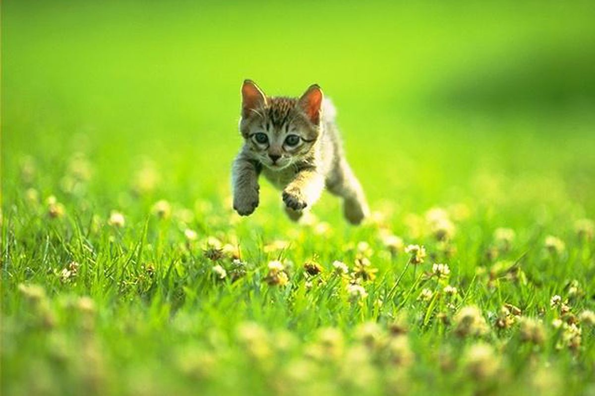

# Procesverslag
Markdown is een simpele manier om HTML te schrijven.  
Markdown cheat cheet: [Hulp bij het schrijven van Markdown](https://github.com/adam-p/markdown-here/wiki/Markdown-Cheatsheet).

Nb. De standaardstructuur en de spartaanse opmaak van de README.md zijn helemaal prima. Het gaat om de inhoud van je procesverslag. Besteedt de tijd voor pracht en praal aan je website.

Nb. Door *open* toe te voegen aan een *details* element kun je deze standaard open zetten. Fijn om dat steeds voor de relevante stuk(ken) te doen.

## Jij

### Ontwerper:
Yunus Emre Alkan

#### Je startniveau:
Zwart

# Je plan

  
De eerste versie/schets van je ontwerp & je persoonlijke uitdaging

  ### De eerste versie/schets:
  

  ### Je ambitie: 
  Aan deze technieken/punten wil ik werken:
  - Het meer en efficienter gebruiken van custom-properties
  - Elementen toevoegen/verwijderen middels Javascript
  - Ervaring en kennis opdoen over CSS Animaties
 

## Voortgang/Feedback 1

  
  In de eerste les ben ik eerst inspiratie gaan opdoen, ik ben daarom ook een moodboard gaan maken. Een moodboard met plaatjes van verschillende interfaces en informatie over de Eeevee's. Ook heb ik een video van de evolutie van Eevee gevonden, als ik tijd heb, wil ik deze ook graag maken. De 2e les ben ik mijn 3 concepten gaan laten zien aan mijn medestudenten, ik ben zelf doorgegaan met concept 1, omdat ik die zelf het leukst vond om te maken. Ik ben een wat betere schets gaan maken en heb hier feedback op gevraagd.
  
  
Mijn bevindingen + wijzigingen (minimaal 5)

  ### Bevinding 1:
  De knoppen indeling wijzigen aan de bovenkant van het scherm.

  #### oplossing:
  Nog mee bezig...

  
  ### Bevinding 2:
  De tas met de items, moet meer opvallen.

  #### oplossing:
  Ik ben de tas meer opvallend gaan maken

  
  ### Bevinding 3:
  De pointer aanpassen
  
  #### oplossing:
  Nog mee bezig...
  
  
  ### Bevinding 4:
  Nadenken over de positie over de pop-up van de item-bag
  
  #### oplossing:
  Ik ben de item-bag op een andere plek gaan neerzetten, waardoor de pop-up goed bij het geheel past.
  
  
  ### Bevinding 5:
  Er zijn nog geen specifieke easter-eggs.
  
  #### oplossing:
  Nog mee bezig...

## Voortgang/Feedback 2

  
Mijn bevindingen + wijzigingen (minimaal 5)

  
  ### Bevinding 1:
  Omschrijving van wat er nog niet orde was (tekst en afbeeding(en)).

  #### oplossing:
  Beschrijving hoe je het hebt hebt opgelost of als het niet gelukt is hoe je het zou oplossen (tekst en afbeeding(en)).

  ### Bevinding 2:
  Omschrijving van wat er nog niet orde was (tekst en afbeeding(en)).

  #### oplossing:
  Beschrijving hoe je het hebt hebt opgelost of als het niet gelukt is hoe je het zou oplossen (tekst en afbeeding(en)).

  ### Bevinding 3:
  ...

## Voortgang/Feedback 3

  
Mijn bevindingen + wijzigingen (minimaal 5)

  
  ### Bevinding 1:
  Omschrijving van wat er nog niet orde was (tekst en afbeeding(en)).

  #### oplossing:
  Beschrijving hoe je het hebt hebt opgelost of als het niet gelukt is hoe je het zou oplossen (tekst en afbeeding(en)).

  ### Bevinding 2:
  Omschrijving van wat er nog niet orde was (tekst en afbeeding(en)).

  #### oplossing:
  Beschrijving hoe je het hebt hebt opgelost of als het niet gelukt is hoe je het zou oplossen (tekst en afbeeding(en)).

  ### Bevinding 3:
  ...

## Reflectie

  
Mijn eindresultaat & persoonlijke ontwikkeling

  ### Je uitkomst - karakteristiek screenshot(s):
  

  ### Dit ging goed/Heb ik geleerd: 
  Korte omschrijving met plaatje(s)

  

  ### Dit was lastig/Is niet gelukt:
  Korte omschrijving met plaatje(s)

  

## Bronnenlijst

continu bijhouden terwijl je werkt

Nb. Wees specifiek ('css-tricks' als bron is bijv. niet specifiek genoeg).

1. bron 1
2. bron 2
3. ...

